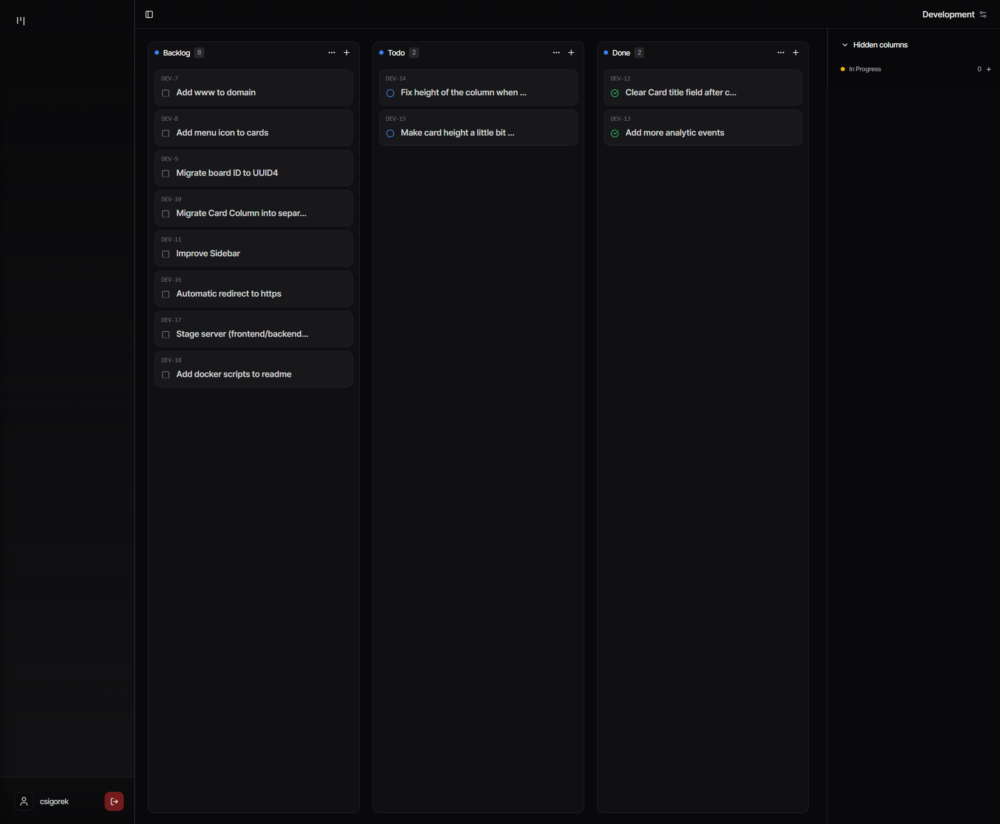

# Locus App

## Overview


## Key Features

- **Modern Authentication:** JWT-based auth flow with secure session management
- **Real-Time Updates:** Optimistic UI updates for seamless user experience
- **Clean Architecture:** Clear separation of concerns with FastAPI and Next.js
- **Efficient Data Model:** SQLAlchemy ORM with proper relationship modeling
- **AI Integration:** Model Context Protocol (MCP) for LLM tool calling capabilities

## Tech Stack

- **Frontend:** Next.js, TypeScript, Tailwind CSS, shadcn/ui
- **Backend:** FastAPI, SQLAlchemy, PostgreSQL
- **Infrastructure:** Docker
- **Testing:** Pytest for API testing
- **CI/CD:** GitHub Actions
- **Analytics:** Umami for user and event analytics

## Project Structure

```
.
├── backend/         # FastAPI server with SQLAlchemy ORM
├── frontend/        # Next.js client application
├── mcp/             # Model Context Protocol for LLM integration
└── scripts/         # Development utilities
```
## Getting Started

### Quick Start with Docker

```bash
# Clone the repository
git clone https://github.com/denver-coder/locus-app.git
cd locus-app

# Launch services
docker compose up -d
```

Access the application:

- Web UI: http://localhost:8000
- API Docs: http://localhost:8000/docs

### Development Setup

Prerequisites:

- Python 3.10+
- Next.js 18+
- PostgreSQL 15

## Technical Highlights

- **Backend:**
  - RESTful API with FastAPI
  - SQLAlchemy ORM with proper relationship modeling
  - Comprehensive API testing with pytest
  - JWT authentication flow

- **Frontend:**
  - Client-side rendering with Next.js
  - Type-safe development with TypeScript
  - Optimistic updates for better UX
  - Responsive design with Tailwind CSS
  - shadcn/ui for modern UI components
  - Analytics integration with Umami

## Planned Enhancements

- Database migrations with Alembic
- Enhanced logging system
- Frontend chat integration
- Board sharing implementation
- User analytics dashboard


## Acknowledgements

This project is a heavily modified fork of the [simple-kanban](https://github.com/mateo-velez/simple-kanban) project, created by Mateo Velez and licensed under the MIT License.